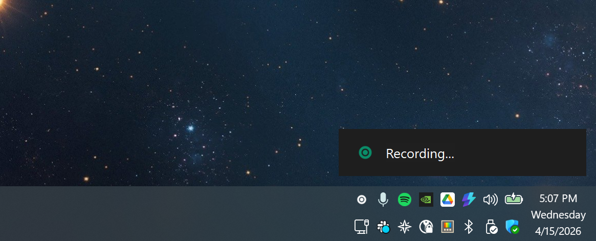
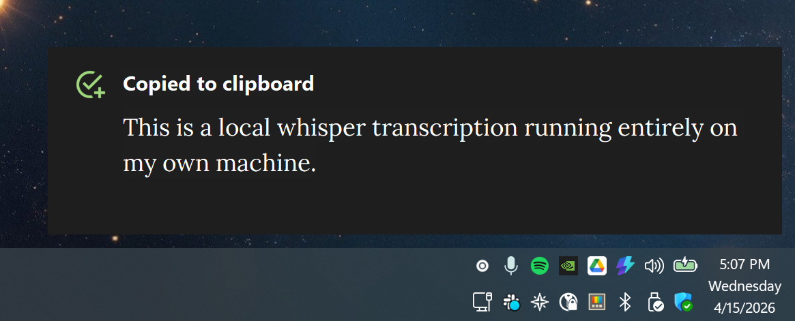

# whisper-local-llm

**Built by [Matt Uffalussy](https://github.com/uffa)** for my own Windows dictation workflow. Written by me with heavy pair-programming assistance from Claude Code (Anthropic) and occasional design consultation with ChatGPT — the direction, architecture, debugging, and review decisions are mine; the AI tools were fast typists and sounding boards. Everything here was tested end-to-end on my own hardware before publishing.

---

Hotkey-triggered local speech-to-text using [whisper.cpp](https://github.com/ggerganov/whisper.cpp). Hold a key to record, release to transcribe, and the resulting text lands on your clipboard — all running locally on your machine, no cloud. Map the hotkey to a foot pedal if you want push-to-talk hands-free; any Stream Deck / macro tool that can send a numpad `+` will work.





## How it works

1. An AutoHotkey v2 script binds **NumpadAdd (`+`)** — the `+` key next to the numpad — as a push-to-talk key.
2. While held, `ffmpeg` records 16 kHz mono WAV from your microphone.
3. On release, ffmpeg is gracefully stopped (via `"q\n"` written to its stdin pipe, so it finalizes the WAV header cleanly) and a PowerShell wrapper runs `whisper-cli.exe` against the recording.
4. The resulting transcript is copied to the clipboard, saved next to the WAV, and a custom toast notification confirms the result.

## Requirements

- **Windows 10 / 11**
- **AutoHotkey v2** — https://www.autohotkey.com/
- **ffmpeg** — default path is the Chocolatey install at `C:\ProgramData\chocolatey\bin\ffmpeg.exe`; update `ffmpeg` at the top of `scripts/whisper-record.ahk` if yours lives elsewhere.
- **whisper.cpp build** — `whisper-cli.exe` and its `ggml*.dll` / `whisper.dll` companions. The `.exe` is committed here; the DLLs are not. Grab matching builds from the [whisper.cpp releases](https://github.com/ggerganov/whisper.cpp/releases) and drop them into the project root. For CUDA acceleration, install the NVIDIA CUDA Toolkit and use the CUDA-enabled build.
- **A Whisper model** in `models/`, e.g. `ggml-small.en.bin` — download from [Hugging Face](https://huggingface.co/ggerganov/whisper.cpp/tree/main).

## Layout

```
whisper-local-llm/
├── scripts/
│   ├── whisper-record.ahk  # AutoHotkey v2 hotkey + recording/transcription state machine
│   └── transcribe.ps1      # PowerShell wrapper that invokes whisper-cli
├── icons/                  # tray + notification icons (rec, check, tray)
├── whisper-cli.exe         # (not committed) whisper.cpp binary — bring your own
├── ggml*.dll, whisper.dll  # (not committed) from the same whisper.cpp release
├── models/                 # (gitignored) put your ggml-*.bin model files here
└── recordings/             # (gitignored) timestamped WAV files live here
```

## Setup

1. **Clone the repo anywhere.** The scripts derive their paths from their own location, so `C:\Tools\Whisper`, `D:\projects\whisper-local-llm`, or wherever else is fine.
2. **Download a whisper.cpp build** from the [whisper.cpp releases](https://github.com/ggerganov/whisper.cpp/releases) — the CUDA build if you have an NVIDIA GPU, otherwise the regular build. Extract `whisper-cli.exe` and all the `ggml*.dll` / `whisper.dll` files into the **repo root** (next to this README). None of them are committed to the repo — you supply your own build.
3. **Download a model** and put it in `models/`, e.g. `models\ggml-small.en.bin`. Models live at https://huggingface.co/ggerganov/whisper.cpp/tree/main.
4. **Edit the `=== USER CONFIG ===` block** at the top of [scripts/whisper-record.ahk](scripts/whisper-record.ahk) — at minimum, set `micName` to your actual DirectShow audio input name. List devices with:
   ```
   ffmpeg -list_devices true -f dshow -i dummy
   ```
   Use the exact string for the entry marked `(audio)`. Other config options (record limits, debounce, ffmpeg override path) are in the same block.
5. **Launch the script.** Double-click `scripts\whisper-record.ahk` or add a shortcut to `shell:startup` so it runs at login. You should see a brief "Whisper script loaded" toast in the bottom-right.

The script auto-detects `ffmpeg.exe` on `PATH` and common install locations (Chocolatey, `C:\Program Files\ffmpeg`). If it can't find one it'll show a dialog telling you to install it or set `ffmpegOverride` in the config block.

The PowerShell transcription wrapper auto-detects the newest installed CUDA toolkit version, so you don't need to edit it when you upgrade CUDA.

## Usage

- **Hold NumpadAdd (the `+` next to your numpad)** to start recording. A "Recording..." toast stays visible for the entire duration.
- **Release** to stop and transcribe. The transcript is copied to your clipboard, written next to the WAV as `<recording>.wav.txt`, and a "Transcript copied to clipboard" toast confirms.
- **Recordings shorter than `minRecordMs` (700 ms)** are silently discarded.
- **Recordings over `maxRecordMs` (90 s)** auto-stop and transcribe anyway.
- A copy of the most recent transcript is kept at `last-transcript.txt` in the project root.

The numpad `+` has its normal behavior suppressed while the script is running (pressing it won't type `+`). The script's `StartRecording` / `StopRecording` functions take a `triggerKey` argument and log it, so adding a second binding (e.g. `NumpadEnter`) is a two-line change — useful if you want to A/B test which key feels better and `grep whisper.log` later to see which you used more.

## Configuration

Tweakable constants live in a clearly-marked `=== USER CONFIG ===` block near the top of [scripts/whisper-record.ahk](scripts/whisper-record.ahk):

| Global           | Default                          | Purpose                                              |
|------------------|----------------------------------|------------------------------------------------------|
| `micName`        | `"Microphone (USB audio CODEC)"` | DirectShow audio input name — change to match yours  |
| `ffmpegOverride` | `""`                             | Leave empty to auto-detect ffmpeg; set to a full path only if auto-detect fails |
| `minRecordMs`    | `700`                            | Recordings shorter than this are silently discarded  |
| `maxRecordMs`    | `90000`                          | Hard cap; recording auto-stops and transcribes       |
| `debounceMs`     | `200`                            | Debounce window for hotkey press/release             |

All paths (recordings dir, log files, icons, transcribe script) are derived from the script's own location via `A_ScriptDir`, so the repo is portable — clone it anywhere and everything works.

To change the Whisper model, pass `-Model` to [scripts/transcribe.ps1](scripts/transcribe.ps1) (default is `small.en`). Any `ggml-<name>.bin` in `models/` works.

### Notifications

The script draws its own dark-themed toast in the bottom-right corner rather than using Windows' standard balloon/toast system. This lets it show custom icons inline next to the text (a recording icon while active, a check on success, a yellow warning triangle from `shell32.dll` on errors) and keeps the positioning consistent on high-DPI displays.

Two toast variants:

- **Status toasts** (`"Recording..."`, `"Transcribing..."`, errors) — compact single-line layout with the icon vertically centered against the text via `SS_CENTERIMAGE`.
- **"Copied to clipboard" toast** — wider layout with a bold Segoe UI title and the actual transcript body underneath in [Lora](https://fonts.google.com/specimen/Lora), a serif designed for on-screen body text. The full transcript is always on the clipboard; only the toast display is truncated at 400 characters.

The `"Recording..."` toast is *persistent* — it stays until the recording ends and gets replaced by the next notification automatically.

## How ffmpeg is launched (and why)

For anyone reading the code and wondering why `StartRecording` uses a `DllCall("kernel32\CreateProcessW")` helper instead of the much simpler `Run` or `ComObject("WScript.Shell").Exec`:

- **`Run(cmd, , "Hide", ...)`** — hides the window but passes `CREATE_NO_WINDOW`, which gives the child process no real console. ffmpeg's dshow audio backend silently fails under that flag and produces 0-byte WAV files.
- **`WshShell.Exec(cmd)`** — gives us a `.StdIn` pipe (which we need to send `"q"` for graceful shutdown) and a real console, but the console window is visible. `WinHide`-ing it after the fact still flashes on every recording.
- **`CreateProcessW` with `STARTF_USESHOWWINDOW | SW_HIDE` and no `CREATE_NO_WINDOW`** — hides the window from the first frame, keeps a real console alive (so dshow works), and we can wire up our own anonymous `CreatePipe` for stdin. Zero flash, full control.

The helper `LaunchFfmpegHidden()` in [scripts/whisper-record.ahk](scripts/whisper-record.ahk) encapsulates all of this. Related helpers: `WritePipeString`, `IsProcessAlive`, `SafeCloseHandle`.

## Logs and debugging

Three log files, all gitignored and all in the project root — delete them freely to start fresh:

- **`whisper.log`** — AutoHotkey state transitions, ffmpeg PIDs, file sizes at each step, transcription exit codes, key press history. **First place to look.**
- **`ffmpeg-report.log`** — ffmpeg's own verbose log (`FFREPORT` at level 48). Shows dshow device negotiation, actual sample rates, any muxer errors.
- **`transcribe-debug.log`** — Captured stdout/stderr from `transcribe.ps1` + `whisper-cli.exe`. Shows model load, CUDA init, the transcript itself, and any whisper errors.

The script also maintains `ffmpeg.pid` — a tiny file that persists between runs so the next script startup can identify and kill an ffmpeg orphan *only if* it was one we launched. If a previous run crashed or was force-killed, this guarantees a clean next start without indiscriminately killing every ffmpeg process on the system.

## Troubleshooting

**Nothing happens when I press NumpadAdd / numpad `+`.**
- Make sure the script is actually running (check the system tray for its icon).
- Another tool might be intercepting the key — Stream Deck's "Num Plus" binding, a gaming keyboard's macro layer, Logi Options+, etc. Disable the competing binding or rebind the script to a different key.
- If the active window is an elevated (admin) process and the script is not, Windows may block the hotkey from reaching it. Right-click the script and "Run as administrator", or run your target app non-elevated.

**The recording WAV is 0 bytes / recordings produce silence.**
- The most common cause is a wrong `micName`. Run `ffmpeg -list_devices true -f dshow -i dummy` and paste the exact `(audio)` entry into the `USER CONFIG` block.
- Another process may be holding the mic exclusively (e.g. a meeting app with exclusive-mode audio). Close it and try again.
- Check `ffmpeg-report.log` — ffmpeg logs exactly why it couldn't open the device.

**`ffmpeg.exe was not found` dialog on startup.**
- Install ffmpeg. `choco install ffmpeg` is the fastest route on Windows; alternatively [download a build from gyan.dev](https://www.gyan.dev/ffmpeg/builds/) and extract it somewhere on your `PATH`.
- If ffmpeg is installed but in a non-standard location, set `ffmpegOverride` in the `USER CONFIG` block to the full path to `ffmpeg.exe`.

**Transcript is empty or whisper-cli errors.**
- Make sure `ggml*.dll` / `whisper.dll` are next to `whisper-cli.exe`. The CUDA build needs `ggml-cuda.dll`; the CPU-only build doesn't.
- Confirm `models/ggml-small.en.bin` (or whatever model you configured) actually exists.
- Check `transcribe-debug.log` — whisper-cli prints the exact error, including missing-DLL messages, CUDA version mismatches, and unreadable WAV headers.

**Toast notifications don't appear.**
- The script draws its own toasts (Gui windows), so this isn't a Windows notification settings problem. If you see nothing at all, the script probably crashed at load — check `whisper.log` for the `script started` line, and run the `.ahk` file from a command prompt to see any parse errors.

**I moved the repo to a new folder and the script stopped working.**
- You probably have an old shortcut or startup entry pointing at the previous location. The scripts themselves are path-independent, but the shortcut needs to be updated.

## State machine

The script tracks one of three states: `idle`, `recording`, `transcribing`. Every failure path (`VerifyFfmpegAlive` detects a dead child, transcription throws, `RunWait` fails, etc.) rolls back to `idle` so a subsequent hotkey press always works. `TranscribeAndPaste` uses a `try/finally` so state always resets even on unexpected exceptions.
